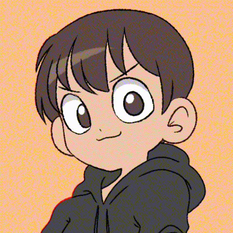

<h3>Tenho uma paixão séria por design gráfico, design de interface do usuário e criação de experiências de usuário intuitivas e dinâmicas com um visual atrativo.</h3>

<h2>Acesse o meu <a href="https://lauro-santos.vercel.app/">Portifólio</a></h2>

#

  <a href="https://github.com/Lauro-Santos">
   
  

<h2 style="color: #ff4d00;">Minhas Formações</h2>

   
  
  
  

<h2 style="color: #ff4d00;">Skills</h2>

   

<!---->

<h2 style="color: #ff4d00;">Contato</h2>

<a href="https://www.instagram.com/lauro034/" target="_blank">
  

##

   
    

